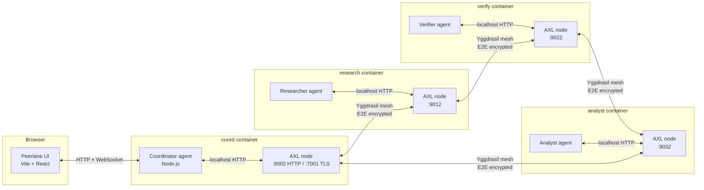

# Architecture

## Mesh topology



## Task flow

```mermaid
sequenceDiagram
    participant UI
    participant Coord as Coord agent
    participant CAXL as Coord AXL
    participant RAXL as Research AXL
    participant VAXL as Verify AXL
    participant AAXL as Analyst AXL

    UI->>Coord: POST /task { question }
    Coord->>UI: WS task_started

    Note over Coord,AAXL: Coord starts the route; workers hand off directly
    Coord->>CAXL: POST /send (DISPATCH → research)
    CAXL->>RAXL: Yggdrasil peer msg
    RAXL-->>Research agent: GET /recv

    Research agent->>RAXL: POST /send (DISPATCH → verify)<br/>with research findings
    RAXL->>VAXL: Yggdrasil peer msg
    VAXL-->>Verify agent: GET /recv

    Verify agent->>VAXL: POST /send (DISPATCH → analyst)<br/>with verified findings
    VAXL->>AAXL: Yggdrasil peer msg
    AAXL-->>Analyst agent: GET /recv

    Analyst agent->>AAXL: POST /send (RETURN → coord)
    AAXL->>CAXL: Yggdrasil peer msg
    CAXL->>Coord: GET /recv

    Coord->>UI: WS contribution + step_update
    Coord->>UI: WS task_complete
```

## Message envelope

Every AXL payload in Peerlane is a JSON-encoded `PeerlaneMessage`:

```ts
interface PeerlaneMessage {
  v: 1;
  mid: string;              // unique message id
  taskId: string;           // groups all messages for one user task
  parentMid?: string;       // reply chain
  from: NodeId;             // "coord" | "research" | "verify" | "analyst"
  to: NodeId;
  type: "DISPATCH" | "RETURN" | "ACK" | "ERROR";
  verb: string;             // e.g. "gather_sources", "cross_reference"
  payload: unknown;         // shape depends on type
  ts: string;               // ISO timestamp
}
```

The AXL node itself doesn't care — it ships bytes. We own the schema.

## Why these decisions

**File-based peer registry.** AXL has no pubkey discovery:
> "There is no way to look up another node's key from the network.
>  Keys MUST be exchanged directly between people."

For a demo, the simplest out-of-band channel is a shared JSON file on a
volume. On startup each agent writes its own `{role → pubkey}`, then
blocks until all four roles have written. This takes ~1s and produces
an inspectable manifest.

**Coord-as-HTTP-gateway, not broker.** The coordinator agent terminates
the frontend's HTTP+WS connection and starts the route, but it does not
orchestrate each worker step. Research forwards directly to verify; verify
forwards directly to analyst; analyst returns directly to coord.

**Direct dependency chain.** Research → verify → analyst. Verify needs
research findings to cross-check; analyst needs both to synthesize a
report. The route is carried inside the AXL payload so every worker knows
only its next peer, not the whole orchestration state.
